= Workflow

[mermaid]
....
---
config:
  theme: neutral 
  flowchart:
    curve: stepBefore
---

flowchart TD
%% Nodes
main@{ shape: event, label: "Merge to\n`main`" }
other@{ shape: event, label: "PR created\n+ push" }
tag@{ shape: rect, label: "Create\ntag" }
format@{ shape: rect, label: "Check\nformatting" }
test@{ shape: rect, label: "Run\ntests" }
lint@{ shape: rect, label: "Linting" }
build@{ shape: rect, label: "Build" }
release@{ shape: rect, label: "GitHub\nRelease" }
start@{ shape: circle, label: "Start" }
report@{ shape: lean-r, label: "Report check\nresults" }
approve@{ shape: trap-t, label: "Approve/reject\ndeployment" }
END@{ shape: dbl-circ, label: "End" }

%% Triggers
main --> start
other --> start

%% Parallel checks
start --> lint
start --> test
start --> build
start --> format

%% Report check results
lint --> report
test --> report
build --> report
format --> report

%% IF
report -- "Other branches" --> END
report -- "main" --> approve

%% Gate
approve -- Approve --> tag --> release --> END
approve -- Reject --> END
....

