= Development Guide

This document describes how to set up and contribute to the url_checker project.

== Setup

=== Prerequisites

* Node.js >= 10.0
* pnpm

=== Installation

[source,bash]
----
# Clone the repository
git clone <repository-url>
cd url_checker

# Install dependencies
pnpm install

# Build the project
pnpm build
----

== Architecture

url_checker is a CLI tool that fetches web pages, extracts URLs from the HTML, and checks each URL for broken links.

=== Technology stack

Node.js:: Runtime environment
TypeScript:: Type-safe JavaScript
Commander:: CLI argument parsing
jsdom:: HTML parsing and DOM manipulation
needle:: HTTP client for fetching pages and checking URLs
Vitest:: Testing framework with fast-check for property-based testing

=== Data flow

[source]
----
CLI Input (URL + options)
        │
        ▼
┌───────────────┐
│   argParser   │  Parse CLI arguments
└───────────────┘
        │
        ▼
┌───────────────┐
│  urlChecker   │  Orchestrate the checking process
└───────────────┘
        │
        ▼
┌───────────────┐
│     http      │  Fetch page content
└───────────────┘
        │
        ▼
┌───────────────────────┐
│   contentFunctions    │  Parse HTML, extract URLs
└───────────────────────┘
        │
        ▼
┌───────────────┐
│ urlFunctions  │  Validate and check each URL
└───────────────┘
        │
        ▼
┌─────────────────────────────────────┐
│  Output (csvOut/jsonYamlOut/sarif)  │
└─────────────────────────────────────┘
----

== Project structure

[source]
----
url_checker/
├── src/                    # Source code
│   ├── cli.ts              # CLI entry point
│   ├── argParser.ts        # Command-line argument parsing
│   ├── urlChecker.ts       # Main orchestration logic
│   ├── http.ts             # HTTP client for fetching/checking URLs
│   ├── contentFunctions.ts # HTML parsing and URL extraction
│   ├── urlFunctions.ts     # URL validation and type detection
│   ├── csvOut.ts           # CSV output formatter
│   ├── jsonYamlOut.ts      # JSON/YAML output formatters
│   ├── sarifOut.ts         # SARIF output formatter
│   └── *.test.ts           # Test files (co-located)
├── dist/                   # Compiled JavaScript output
├── eslint.config.js        # ESLint configuration
├── tsconfig.json           # TypeScript configuration
├── package.json            # Project metadata and scripts
├── README.adoc             # User documentation
└── DEVELOPMENT.adoc        # Developer guide
----

== Commands

=== Development

[source,bash]
----
# Run the tool directly (without building)
pnpm url_checker https://example.com

# Build the project
pnpm build

# Run tests
pnpm test

# Run tests in watch mode
pnpm test:watch

# Run tests with UI
pnpm test:ui

# Run tests with coverage
pnpm test:coverage
----

=== Code quality

[source,bash]
----
# Lint code
pnpm lint

# Lint and fix issues
pnpm lint:fix

# Format code
pnpm format

# Check formatting
pnpm format:check
----

=== Packaging

[source,bash]
----
# Build and create npm package
pnpm packer

# Generate API documentation
pnpm apis
----

== Imports

Source files use ES module imports with relative paths:

[source,typescript]
----
import * as URL from './urlFunctions';
import * as pageFun from './contentFunctions';
import * as http from './http';
----

Types are exported from their respective modules and can be imported directly:

[source,typescript]
----
import { results } from './urlFunctions';
import { urlFound, pageHTML } from './contentFunctions';
----

== Adding dependencies

[source,bash]
----
# Add a runtime dependency
pnpm add <package-name>

# Add a development dependency
pnpm add -D <package-name>
----

== Testing

Tests are co-located with source files using the `*.test.ts` naming convention.

The project uses:

* **Vitest** for the test runner
* **fast-check** for property-based testing

=== Running specific tests

[source,bash]
----
# Run tests for a specific file
pnpm test -- src/urlFunctions.test.ts

# Run tests matching a pattern
pnpm test -- -t "urlTyper"
----

=== Writing tests

[source,typescript]
----
import { describe, expect, vi, beforeEach, afterEach } from 'vitest';
import { fc, test } from '@fast-check/vitest';

describe('myFunction', () => {
  // Standard test
  test('should do something', () => {
    expect(myFunction()).toBe(expected);
  });

  // Property-based test
  test.prop([fc.string()])('should handle any string', (input) => {
    expect(myFunction(input)).toBeDefined();
  });
});
----

== CI/CD Pipeline

The project uses reusable GitHub Actions workflows from the https://github.com/tylerkelly13/.github[tylerkelly13/.github] repository. See https://github.com/tylerkelly13/.github/blob/main/.github/WORKFLOWS.adoc[WORKFLOWS.adoc] for internal details of the reusable workflows.

.Mermaid source
[%collapsible]
====
[source,mermaid]
----
graph LR
    subgraph checks["check.yml — PR / manual"]
        A1["pull_request / workflow_dispatch"] --> A2["node-run-checks.yml\n(node: 24.x, pnpm: latest)"]
    end

    subgraph deploy["deploy.yml — tag push"]
        B1["push tag v*"] --> B2["node-run-checks.yml\n(node: 24.x, pnpm: latest)"]
        B2 -->|"artifact-id"| B3["node-gh-release.yml"]
    end
----
====

=== Workflow summary

* **check.yml** — Runs on pull requests to `main` and `release/*` branches, and on manual dispatch. Calls `node-run-checks` with Node 24.x and pnpm latest. Ignores documentation changes.
* **deploy.yml** — Triggers on `v*` tag pushes. Calls `node-run-checks` first, then passes the build artifact to `node-gh-release` to create a draft GitHub release.

== Troubleshooting

=== Tests fail with version mismatch

If SARIF tests fail with version mismatch errors (e.g., expected '0.1.0' but got '0.2.0'), update the expected version in `src/sarifOut.test.ts` to match `package.json`.

=== TypeScript compilation errors after dependency update

[source,bash]
----
# Clean and rebuild
rm -rf dist node_modules
pnpm install
pnpm build
----

=== URL check hangs or times out

Some URLs may have slow response times or block automated requests. The tool does not have configurable timeouts. Consider using the `-s` selector option to limit the scope of checked URLs.
